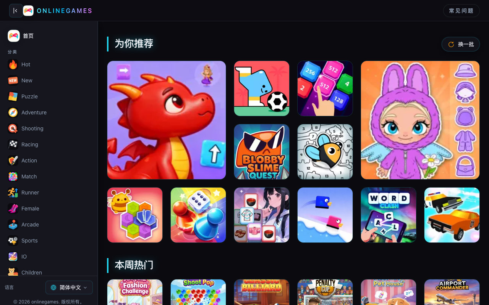
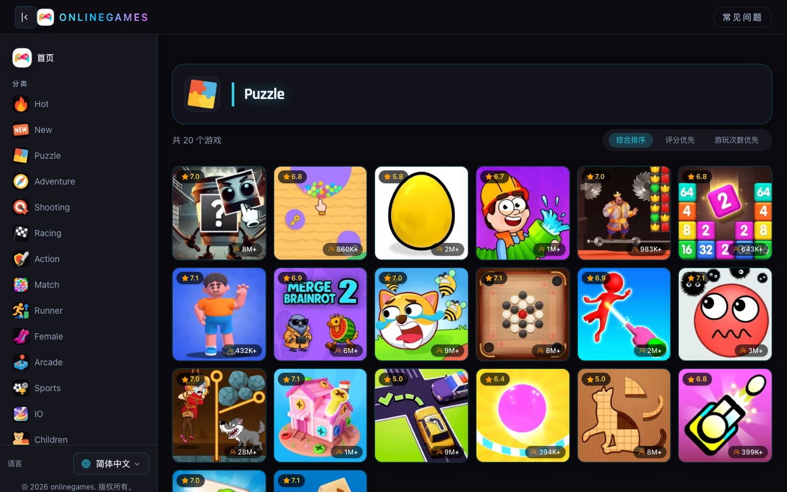
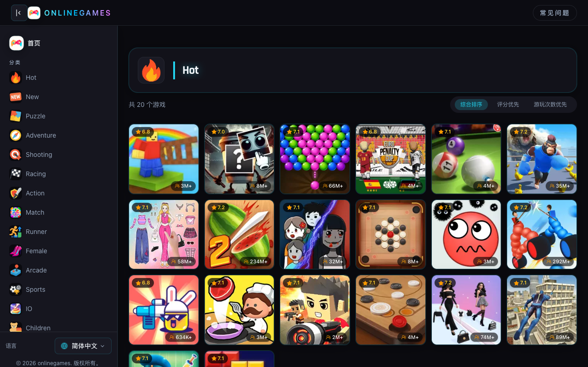

# Free Games to Play Without Losing Your Mind (or Your Evening)

It's 9 PM on a weeknight. You don't want to commit to a two-hour movie. You don't want to scroll social media into oblivion. You just want to play something — something free, something instant, something that doesn't ask for your credit card or your firstborn. So you search "free games to play" and that's where the nightmare begins.

Fake download buttons. Sign-up walls. Sketchy pop-ups that make your browser feel like it needs a shower. I've been there more times than I'd like to admit.

## 1. The Real Problem Isn't Finding Games — It's Finding Playable Ones

There's no shortage of free games on the internet. That's actually the problem. There are thousands of them, and most are buried under layers of ads, broken links, and sites that clearly haven't been updated since the Flash era. You click a thumbnail that looks promising, and you get a loading screen that never ends, or a game that's "free" for exactly three minutes before it hits you with a paywall.

I'm not picky. I don't need AAA graphics or some groundbreaking storyline. I just want to click and play. That's it.

## 2. Where I Actually Play Now

About six months ago, a friend sent me a link to [topfreegames.org](https://topfreegames.org/). I wasn't expecting much — I'd seen plenty of game aggregator sites before and most of them are garbage dressed up in colorful thumbnails.

But this one was different. No sign-up prompt. No "download our app" banner. Just a clean page with games sorted into actual categories. I clicked on a racing game, it loaded in seconds, and I was playing. No pre-roll ads. No interruptions. I looked up and forty minutes had gone by.

That doesn't happen often with free games to play online. Usually I spend more time trying to get a game to work than actually playing it.

## 3. Categories That Actually Mean Something

Here's a small thing that matters more than you'd think: proper categories. Most free game sites throw everything into a blender. You click "Puzzle" and get a dress-up game. You click "Action" and get a broken link.

On topfreegames.org, the categories are honest. Shooting games are actually shooters. Puzzle games make you think. There's even a "Children" and "Educational" section — and if you've ever tried to find a kid-friendly free game site that isn't plastered with sketchy ads, you know how rare that is.

I usually hit the "Hot" section when I don't know what I'm in the mood for. It's a good enough filter for "what's worth playing right now."

## 4. How I Actually Use It

I'm not a hardcore gamer. I play maybe two or three times a week, usually in short bursts — lunch break, late evening, waiting for laundry to finish. My bar is low: open a browser, pick a game, play, close the tab, move on with my life.

You'd think that's easy to find. It's not. Most platforms either want too much from you — accounts, downloads, social features — or give you too little in return. Games that look decent in the thumbnail but play like they were made in a weekend.

I've settled on [topfreegames.org](https://topfreegames.org/) as my go-to. It's not the only site with free games to play, but it's the one I keep coming back to because it respects my time. No friction. No nonsense.

## 5. It's Not Perfect

I'll be honest — the search functionality could be better. If you're looking for a specific game by name, you're mostly relying on browsing through categories. And some of the game thumbnails don't tell you much about what you're about to play.

But these are minor gripes. For a free, no-registration, browser-based platform, it's doing more right than wrong. I've played dozens of free games to play on various sites, and this is the one I don't get annoyed using.

## 6. Stop Searching. Start Playing.

You came here looking for free games to play. Not for a ten-step guide on how to evaluate gaming platforms. Not for a comparison chart. You want to play something, right now, for free, without jumping through hoops.

Go to [topfreegames.org](https://topfreegames.org/). Pick a category. Click a game. That's it.

Your evening's waiting. Don't waste it on another search results page.