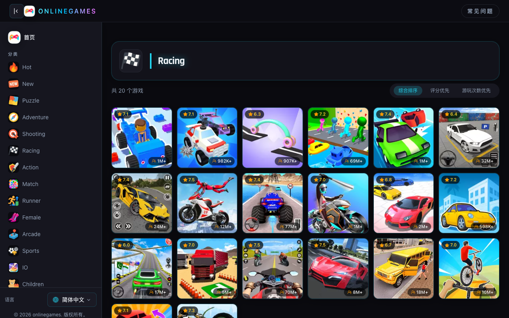

# 免费游戏那么多，为什么你总觉得找不到能玩的？

每次打开浏览器想找点东西消磨时间，结局几乎一样：点进一个网站，满屏广告弹窗，随便点开一个游戏，加载半天，画面粗糙得像2005年的Flash残留物。关掉，换一个站，重复以上步骤。十五分钟过去了，一局都没玩上。

这件事困扰了我很长时间。不是没有 free games to play，是筛选成本太高了。

## 1. 免费游戏的真正问题不是"免费"，是"噪音"

市面上标榜免费在线游戏的平台数量极其庞大，但质量参差不齐到了荒谬的程度。很多站点靠堆量取胜——把几千个游戏塞进页面，分类模糊，缩略图劣质，点进去一半打不开，另一半需要你装插件或注册账号。用户以为自己在挑选，其实是在做垃圾分拣。

我逐渐意识到，找 free games to play 这件事，关键不在于"有多少可选"，而在于"有没有人替你做过一轮筛选"。一个好的平台应该像一家选品认真的书店，不是堆满盗版光盘的地摊。

## 2. 我后来是怎么解决这个问题的

大概半年前，我偶然点进了 [TopFreeGames](https://topfreegames.org/)，最初没抱什么期待。但第一印象让我停下来了——页面干净，分类清楚，没有扑面而来的广告轰炸。我随手点开一个益智类游戏，两秒加载完毕，直接开玩，不需要注册，不需要下载。

这种体验在免费游戏领域是稀缺的。

后来我花了不少时间在这个站上，逐渐摸清了它的逻辑。它的游戏按类型分得很细：解谜、冒险、射击、竞速、动作、体育、IO对战，甚至有专门的儿童和教育类板块。不是那种敷衍的大类堆叠，每个类目下的游戏确实在调性上是统一的。这说明背后有人在做整理，而不只是程序自动抓取。

## 3. 什么样的人适合用这种平台

我观察了一下自己的使用场景：午休时有二十分钟空档，晚上不想看视频但又不想做正事，周末下午等人时的无聊间隙。这些场景的共同特征是——我不想投入任何启动成本。不想创建账号，不想等加载，不想研究操作说明。我只想打开一个页面，看到一堆可以直接玩的 free games to play，点开就是。

[TopFreeGames](https://topfreegames.org/) 恰好满足的就是这个需求。它不是那种需要你"经营"的游戏平台，不搞社交系统，不搞成就排行，不搞付费解锁。它就是一面墙，上面挂满了随时可以取下来玩的东西，玩完放回去，没有负担。

## 4. 几个我反复打开的类型

益智类是我个人消耗时间最多的区域。这类游戏规则简单，但需要一点动脑，正好适合那种"不想彻底放空又不想太费劲"的状态。竞速类偶尔玩，适合需要快速释放一下注意力的时候。射击类的手感比我预期好不少，考虑到这些都是浏览器直接运行的游戏，完成度已经相当可以了。

我没有全部类型都试过，但我试过的那些，没有遇到过打不开、卡死、或者体验极差的情况。这在 free games to play 的领域里，已经算是一个很高的基准线。

## 5. 它不完美，但它解决了一个真实问题

我不会说这个平台适合所有人。如果你是重度玩家，追求3A级画质和深度叙事，这里显然不是你的战场。但如果你和我一样，只是需要一个随时能打开、不需要任何门槛就能找到 free games to play 的地方，那这个站的存在是有实际价值的。

它解决的是一个很具体的问题：在你想玩点什么的那个瞬间，把摩擦力降到最低。不用搜索，不用比较，不用忍受垃圾体验。打开 [TopFreeGames](https://topfreegames.org/)，挑一个类型，点进去，开始玩。整个过程不超过十秒。

如果你也厌倦了在各种劣质站点之间跳来跳去，我的建议是先试一次，自己判断。