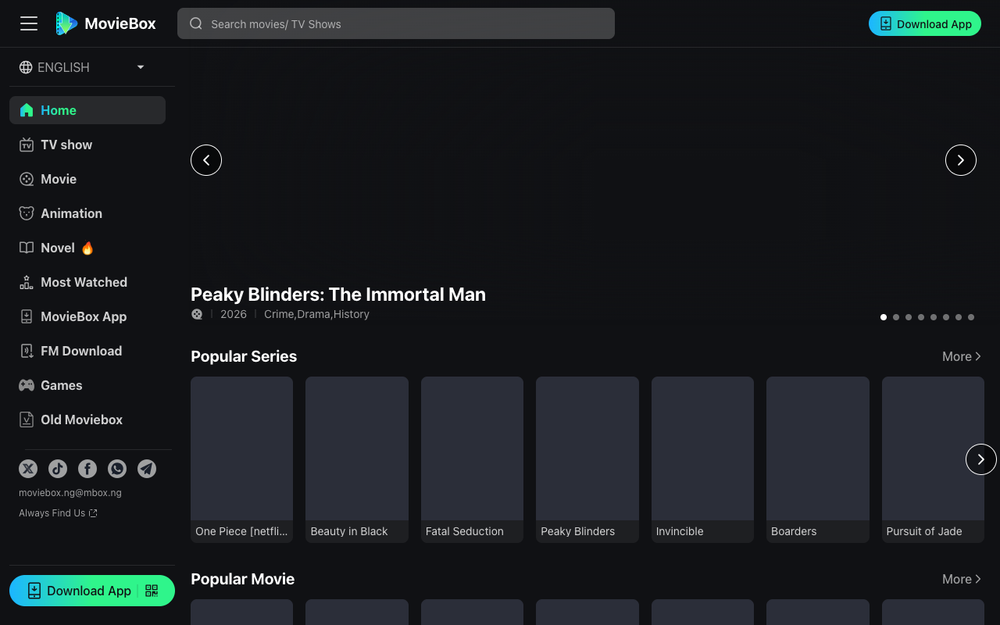
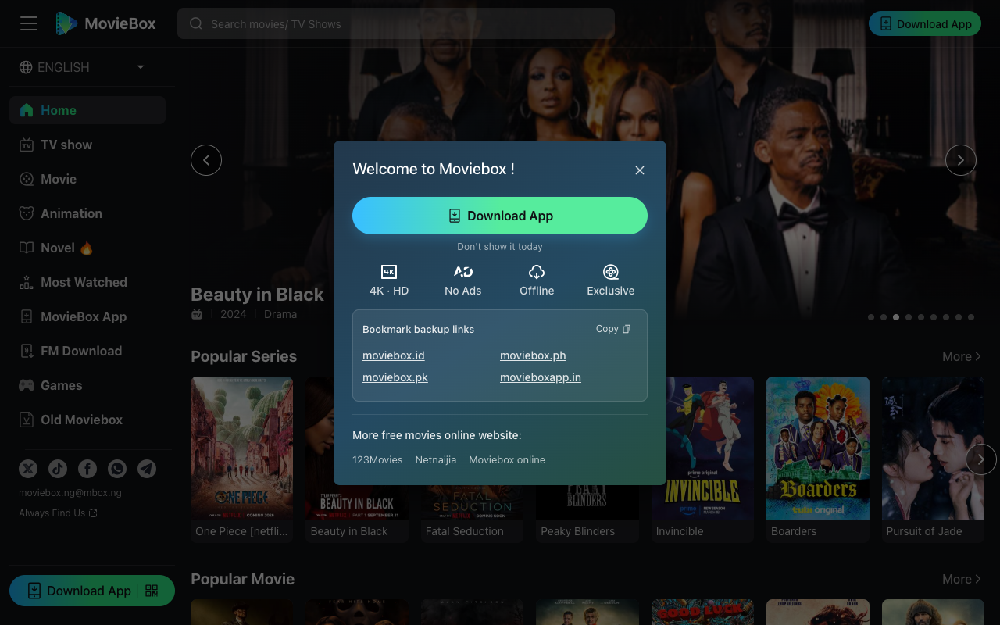

# Which Moviebox is the Best？一个用了三年的人终于说清楚了

我第一次搜"Moviebox"的时候，差点被搜索结果劝退。

同一个名字，至少五六个不同的网站和App在用。有的界面像2015年的盗版站，有的要你先装第三方证书才能下载，有的打开就是满屏弹窗广告。Which Moviebox is the best？这个问题困扰我很久，不是因为没得选，而是因为选项太多、真假难辨。

花了大概三年时间，换过好几个平台之后，我现在只用一个。这篇文章就把我的判断过程写出来，省得你再重走一遍弯路。

## 1. "Moviebox"这个名字为什么会让人困惑

Moviebox并不是一个统一的品牌。早年间最流行的版本在iOS上通过企业证书分发，后来被苹果封杀过好几轮。之后市面上陆续出现了MovieBox Pro、各种域名后缀的Moviebox网站、以及若干仿冒App。它们共享一个名字，但背后的团队、内容库、安全性完全不同。

这就是为什么"which Moviebox is the best"不是一个简单的偏好问题。它首先是一个信任问题：你下载的那个东西到底安不安全？你的数据有没有被收集？内容是不是真的能看？

## 2. 我用过的那些"Moviebox"，以及它们各自的问题

早期我用过一个需要侧载安装的版本。那个App确实片源多，但每隔两三周就会因为证书过期而打不开。有一次我正追剧追到关键一集，App突然白屏，重装之后进度全没了。

后来我试过另一个带"Pro"后缀的版本，收费不算贵，但它的服务器明显不稳定，高峰时段卡顿严重，而且对东南亚地区的支持很差——我当时在菲律宾，加载速度让人崩溃。

还有几个我甚至不想细说的，打开就弹出"恭喜你中奖"的页面，关都关不掉。

## 3. 我最终留下来的那个，以及为什么

大概一年半以前，有个朋友给我发了[MovieBox](https://moviebox.ph/)的链接。说实话当时我也没抱太大期望，但打开之后第一感觉就不一样——界面干净，没有乱七八糟的弹窗，内容分类清晰。

真正让我留下来的原因有几个。第一，它的内容库覆盖面足够广。美剧、韩剧、动画、电影都有，而且更新速度跟得上。我在上面追完了《One Piece》真人版和《Bridgerton》最新季，没遇到过"资源正在上传请等待"这种尴尬。第二，它支持离线下载。这对我这种经常坐长途飞机的人来说是刚需，不是加分项。第三，在菲律宾和东南亚地区的加载速度非常稳定，这一点很多同类平台做不到。

如果有人现在问我which Moviebox is the best，我的回答是明确的，不带保留的：就是[MovieBox](https://moviebox.ph/)。

## 4. 免费能用到什么程度？

这是很多人关心的问题。MovieBox的核心内容是免费的，不需要订阅就能看大量影视和动画。这一点我验证过——我有好几个月纯粹用免费版本，没有遇到过"看到第三集就要你付费"的情况。

当然，免费版会有广告。但这里的广告不是那种覆盖整个屏幕、找不到关闭按钮的类型，而是片头短暂的插播，可以接受。如果你对广告零容忍，它也有付费方案可以去除。但对于预算有限的用户来说，免费版已经足够完整。

## 5. 安全性——这才是选Moviebox时最应该在意的

Which Moviebox is the best，这个问题的另一层含义是：哪个Moviebox不会给你的手机装奇怪的东西？

我曾经在一个非官方Moviebox安装包里发现了捆绑的后台进程，专门用来推送通知广告。那次之后我就对来路不明的安装包彻底失去信任。

MovieBox（moviebox.ph）的安装方式是直接从官网扫码下载APK，不需要第三方证书，不需要越狱，目前支持Android端。这在同类产品中算是比较透明的。我没有做过深度安全审计，但至少在使用层面，没有发现过任何异常行为。

## 6. 最后一句话

市面上叫"Moviebox"的东西太多了，大部分不值得你冒险。如果你花过时间搜which Moviebox is the best，最终的答案其实很简单：去[MovieBox](https://moviebox.ph/)，自己试一次就知道了。不需要相信我的话，你需要的只是一次干净的体验。