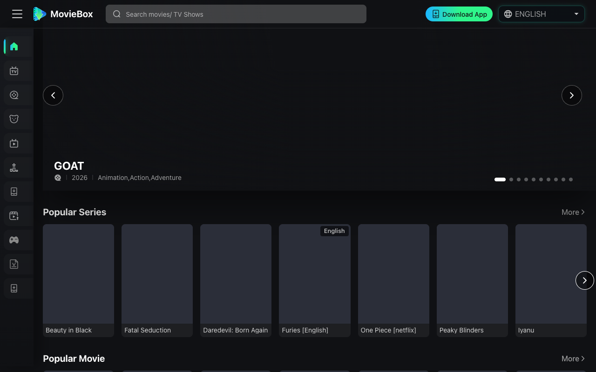

# I Used Streamex for Weeks — Here's Why I Moved On

There's a particular kind of frustration that comes with free streaming platforms: you find something worth watching, you get three episodes in, and then the source dies. Or the video quality drops to something unwatchable. Or a popup ad hijacks your screen right when the plot gets interesting. That was my experience with Streamex, and it's what eventually pushed me to look elsewhere.

This isn't a takedown piece. Streamex works — sometimes. But "sometimes" isn't a standard I'm willing to settle for when better options exist.

## 1. What Went Wrong With Streamex

Streamex presents itself as a solid free streaming option, and on the surface, it checks the right boxes. There's a content library with movies, series, and some animated titles. The interface is functional enough to navigate. But the problems show up quickly once you start using it regularly.

The biggest issue is source reliability. I'd start a series on Streamex, and by the third or fourth episode, the link would either fail to load or switch to a noticeably lower-quality source. This happened consistently with newer releases — exactly the titles most people are searching for. It suggests that Streamex's infrastructure can't keep up with demand, which is a fundamental problem for a streaming platform.

Then there's the ad situation. I don't expect a free service to be ad-free. But Streamex's ad placement is aggressive in ways that actively degrade the viewing experience. Popups on pause, popups on episode switch, redirects to external pages — it feels less like a streaming site and more like a monetization engine with a video player attached.

## 2. Streamex vs MovieBox — Not a Close Call

I've seen "streamex vs moviebox" come up often in search results, so clearly I'm not the only one weighing these two. After spending real time on both, my position is straightforward: [MovieBox](https://themoviebox.org/) is the better platform by a significant margin.

Content depth is the first differentiator. MovieBox carries everything from mainstream Hollywood titles to anime, Nollywood series, and Netflix-adjacent releases that get updated quickly. I watched the entirety of Daredevil: Born Again's latest season there without a single source interruption. On Streamex, I couldn't even get through three consecutive episodes of a popular series without hitting a dead link.

Access and usability matter too. MovieBox has a dedicated app with offline download support that actually works — I've tested it on flights and long commutes, and the downloaded files play without audio-sync issues. Streamex's download feature, by comparison, felt like an afterthought. The MovieBox interface is clean, logically organized across movies, TV shows, animation, and even live sports. You don't waste time figuring out where things are.

Stability is where the gap becomes undeniable. Over three months of daily use, I've experienced fewer playback failures on MovieBox than I did in two weeks on Streamex. That's not a statistic I had to track carefully — it's just obvious from lived experience.

## 3. The "Streamex Alternative" Search Usually Leads Nowhere Good

If you've searched for a streamex alternative, you've probably landed on listicles that recommend a dozen platforms, half of which are either defunct, riddled with malware risks, or running on scraped low-quality sources. I went through several of those recommendations myself before settling on something I could actually rely on.

What made [MovieBox](https://themoviebox.org/) stick wasn't a single feature — it was the accumulation of things done right. The content library is deep and consistently updated. The player doesn't break. The ads, where they exist, don't hijack your session. The multilingual interface (covering English, Arabic, French, Indonesian, Hindi, Urdu, and Filipino) makes it accessible to a genuinely global audience, which is something Streamex barely attempts.

A streaming platform's job is simple: let you watch what you want, when you want, without unnecessary friction. MovieBox does that job. Streamex, in my experience, doesn't do it reliably enough.

## 4. How I Actually Use It Now

Most weeknights, I'll watch an episode or two on my phone through the MovieBox app. Weekends are for movies on a larger screen. The offline download feature has become essential for travel — I'll cache two or three films before a trip and not think about connectivity. It's a small thing, but it reflects a platform that's been built with actual usage patterns in mind, not just a content catalog to browse.

Streamex never gave me that kind of confidence. Every session felt like a gamble — would the episode load? Would the quality hold? Would I get redirected to some external page mid-scene? That uncertainty adds up, and eventually it's just not worth the trouble.

## 5. One Last Thing

I'm not here to tell you Streamex is unusable. It has content, it has a player, and on a good day it works fine. But that uncertainty — wondering whether tonight's episode will actually load — erodes more than your patience. It erodes the habit of watching altogether.

If you've already started to feel that, themoviebox.org is worth a serious look.