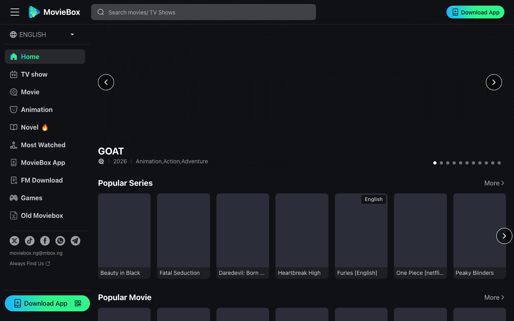
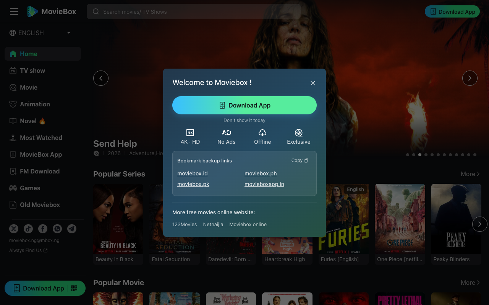

# MovieBox 怎么下载安装？一个真正装过的人来说清楚

我第一次用 MovieBox，是因为有一部剧在手头所有平台上都找不到完整资源。零散的片段倒是有，但没有一个地方能从头看到尾。搜索中偶然打开了 [MovieBox](https://moviebox.ph)，装好 app 之后十分钟，我已经在看第一集了。

网上关于 MovieBox 下载安装的教程不少，但大多数要么跳步骤，要么信息过时，要么一看就不是自己亲手装过的人写的。这篇是我按自己的实际操作写的完整流程。

## 1. 先说最关键的一点：它不在应用商店里

MovieBox 没有上架 Google Play Store。这决定了它的安装方式跟普通 app 完全不同——你需要从官网下载 APK 文件手动安装。

很多人在这一步就走偏了：搜"moviebox download"，点进各种来路不明的第三方网站，下载到的要么是旧版本，要么捆绑了多余的东西。我的建议很明确：只从官网 moviebox.ph 下载。页面顶部有下载按钮和二维码，认准这一个入口就够了。

## 2. 完整安装流程，按我实际操作来写

手机浏览器打开 moviebox.ph，页面顶部有"Download App"按钮，点击就开始下载 APK 文件。如果你是在电脑上看到这个页面，扫页面中间的二维码也一样。

下载过程中浏览器会弹一个警告，说"此文件可能有害"——这是 Android 对所有非应用商店来源的 APK 的统一提示，不用担心，点"仍然下载"。

文件下好后，在通知栏或者"下载"文件夹里找到它，点击安装。系统会提示你需要开启"允许此来源安装应用"的权限——去设置里打开这个开关，返回继续安装就行。

从点击下载到打开 app 首页，我实测不到两分钟。不需要注册，打开就能浏览所有内容。

## 3. 装好之后，第一眼的感受

MovieBox 的界面很直接：首页按剧集、电影、动画、小说分区，顶部有热门排行榜。没有弹窗，没有强制选兴趣标签的引导流程，也没有在你还没看清内容之前就催你注册的弹窗。

播放体验也不错。我点开一部正在追的剧，缓冲几乎没有等待，画质可调。离线下载功能是真正能用的那种——可以把整季下载到本地，网络不好的时候直接看本地文件。

## 4. 搜索"moviebox download"时容易遇到的混淆

网上叫"MovieBox"的东西不止一个：MovieBox、MovieBox Pro、各种旧版本。它们名字像，但不是同一个产品。我在用的是 [MovieBox 官网](https://moviebox.ph) 提供的当前版本，官网上也有一个"Old Moviebox"入口——团队自己在做新旧区分。如果你以前试过某个旧版本觉得体验差，现在的版本值得重新看看。

另外，有些网站会写"MovieBox iOS 下载"，但目前主要的安装渠道是 Android APK。iOS 的情况我没亲自验证过，这里不做断言。

## 5. 值得装，但要从对的地方开始

用了三个月，看过热门剧集、好莱坞新片、几部动画。MovieBox 不是什么都能替代的万能平台，但在内容覆盖和使用体验上确实扎实。

如果你打算装 MovieBox，记住一件事就够了：从 [moviebox.ph](https://moviebox.ph) 开始，两分钟搞定，打开就能看。
