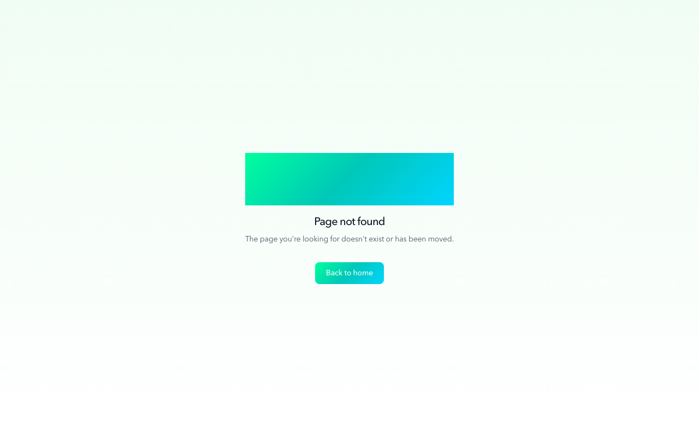
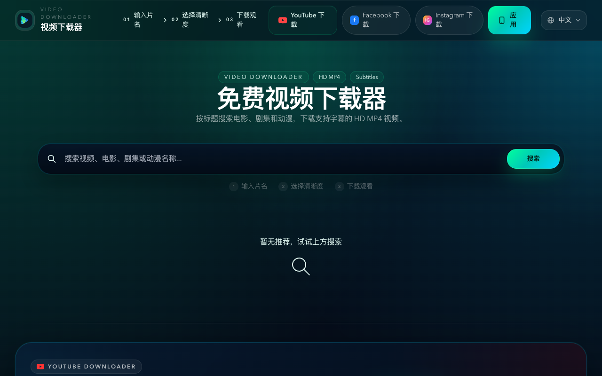

# Video Downloader Via Link: How I Stopped Juggling Three Tools for Three Platforms

I used to keep a mental list of which download tool worked for which platform. One site for YouTube, a different one for Instagram Reels, and a third—unreliable but occasionally functional—for Facebook videos. Each had its own quirks: different UI layouts, different ad patterns, different failure modes. The worst part wasn't that any single tool was terrible. It was the overhead of maintaining the whole system. Every time I wanted to save a video, the first decision wasn't "what quality do I want" but "which downloader do I open for this link."

That friction sounds minor until you add it up across dozens of downloads a month. I didn't need a better YouTube downloader. I needed to stop thinking about which tool to use.

## 1. Why the "One Link, One Tool" Problem Persists

Most video downloader via link services are built around a single platform's video structure. YouTube's format is well-documented, so YouTube downloaders are plentiful and mostly reliable. Instagram and Facebook are harder targets—their video URLs are less predictable, and many tools that claim cross-platform support quietly fail on two out of three.

The result is that users who regularly save videos from multiple sources end up with a patchwork of bookmarks. It's not a catastrophic problem, but it's a persistent one. And persistent friction is the kind that eventually pushes you to look for something different.

## 2. Finding a Single Entry Point for YouTube, Instagram, and Facebook

I came across [videodownloader.site](https://videodownloader.site) while searching for a video downloader via link that could handle more than just YouTube. What caught my attention first was actually its search-based workflow—you can type a movie or show title directly into the site and browse downloadable results without needing a URL at all. That's useful for longer-form content like films and series.

But the feature that earned it a permanent bookmark was its support for downloading videos from YouTube, Instagram, and Facebook via link. One interface, three platforms, same paste-and-download flow. I've been using it for several weeks now, and the consistency across platforms is what keeps me coming back.

## 3. Testing Across Three Platforms: What Actually Worked

I don't recommend tools based on first impressions, so I ran the workflow through real links from each platform over a few weeks.

YouTube performed exactly as expected. Short clips, long lectures, music videos—the video downloader via link process was fast, the 1080P MP4 files were clean, and I didn't encounter parsing errors. This is the baseline for any tool in this category, and videodownloader.site met it without issues.

Instagram was the more interesting test. I pasted links from both Reels and standard post videos. Both resolved correctly, which is something I can't say for several other tools I've tried. I didn't test Stories, so I can't speak to that, but for the two most common Instagram video types, the experience was smooth.

Facebook links took slightly longer to parse, which I attribute to the platform's more complex URL structure rather than any tool-side inefficiency. Downloads completed without errors. The quality options were more limited than YouTube's, but that's a source-side constraint, not a tool limitation.

## 4. Two Paths in One Tool: Link Pasting and Title Search

What makes videodownloader.site slightly unusual among video downloader via link tools is that it offers a parallel workflow. If you have a URL ready, paste it and download—standard behavior. But if you're looking for a specific movie, TV show, or anime and don't have a link yet, you can search by title directly on the site, browse results, and pick your quality and subtitle options from there.

I use both paths depending on what I'm downloading. Social media clips go through the link route. Movies and series go through search. Having both options in the same place eliminates the need to visit a source platform first, copy a URL, then come back. It's a small structural advantage, but it compounds over time.

## 5. Quality Options, Subtitles, and Practical Limits

The available quality tiers for search-based downloads are 480P, 720P, and 1080P in MP4 format. The YouTube downloader section mentions 4K support, which is a welcome addition for that specific platform. For most mobile and tablet viewing, 1080P is more than sufficient, and the 480P option is genuinely useful when storage or bandwidth is limited.

Subtitle support deserves a specific mention. Some search results include downloadable subtitle files alongside the video, which is a meaningful feature for anyone watching content in a non-native language. The subtitle and video files download separately, giving you control over what you keep. For video downloader via link downloads from social platforms, subtitle availability depends on what the source provides—that's a platform-level variable, not something any tool can guarantee.

## 6. The Case for Consolidation

The value of [videodownloader.site](https://videodownloader.site) isn't that it does something no other video downloader via link tool can do. It's that it does what three separate tools used to do for me, in one place, without making me think about which tool to open first. YouTube, Instagram, Facebook—same interface, same flow. Add the title search capability for films and series, and you've got a tool that covers both the "I have a link" and "I have a title" scenarios.

I cleared three bookmarks from my browser the week I started using it. That's not a dramatic story, but it's an honest one—and for a utility tool, removing friction is the highest compliment I can give.